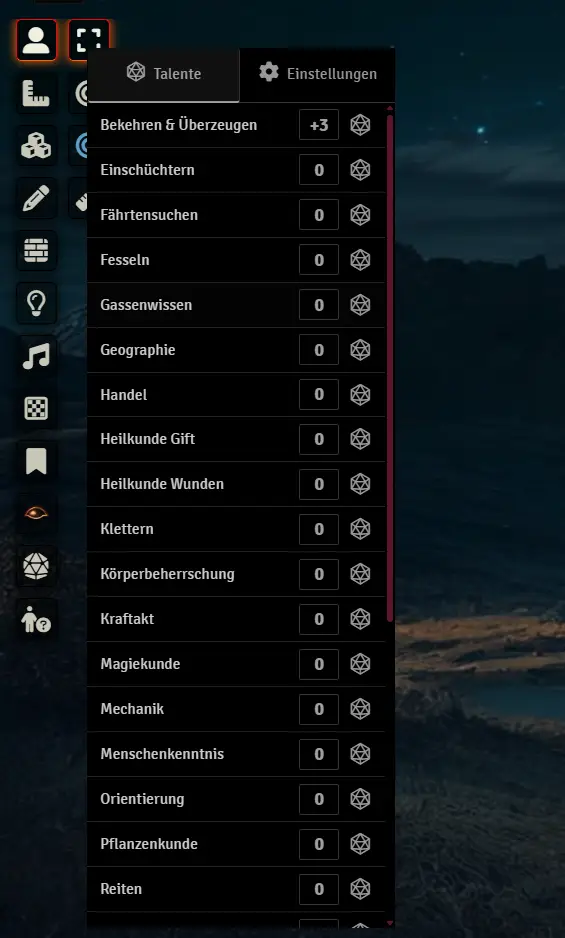
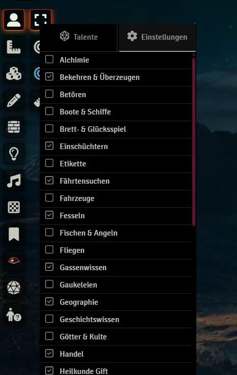
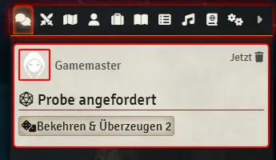

# e9l DSA5 / TDE5 Request Check

A Foundry VTT module for DSA5 / TDE5 that streamlines skill check requests for Game Masters.

## Features

- **Quick Skill Requests**: Send skill check requests to players with a single click
- **Modifier Support**: Apply modifiers (-10 to +10) to any skill check using mouse wheel or arrow keys
- **Customizable Skill List**: Show/hide skills based on your campaign needs
- **Persistent Settings**: Saves your modifier preferences and skill visibility settings
- **Clean UI**: Minimal, dark-themed panel that integrates seamlessly with Foundry VTT
- **German Localization**: Full German language support for DSA5

## Requirements

- Foundry VTT v12+
- DSA5 System

## Installation

1. In Foundry VTT, navigate to **Add-on Modules**
2. Click **Install Module**
3. Paste the manifest URL: `https://raw.githubusercontent.com/xerberde/e9l-request-probe/main/module.json`
4. Click **Install**

## Usage

1. Click the person icon (🧑‍🎓) in the scene controls (GM only)
2. Select skills and set modifiers as needed (you can use mouse wheel to change the numbers for each talent)
3. Click the dice icon to send skill check requests to chat
4. Players can see the requested checks with modifiers in the chat

### Tabs
- **Talente (Skills)**: View and request skill checks
- **Einstellungen (Settings)**: Configure which skills appear in the main list

## Technical Details

The module automatically loads skills from the DSA5 system configuration and provides fallback support for standard DSA5 talents if system skills cannot be loaded.

## Demo Video
https://github.com/user-attachments/assets/e7ed8ca1-dd6a-4bbb-b1eb-c8fdc970c94a

## UI Images

